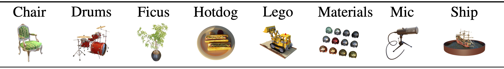

# TT-NF: Tensor Train Neural Fields

This repository implements experiments from our paper titled "TT-NF: Tensor Train Neural Fields" by Anton Obukhov, Mikhail Usvyatsov, Christos Sakaridis, Konrad Schindler, and Luc Van Gool. [[Project Website]](https://www.obukhov.ai/ttnf)


## Abstract

Learning neural fields has been an active topic in deep learning research, focusing, among other issues, on finding more compact and easy-to-fit representations.
In this paper, we introduce a novel low-rank representation termed Tensor Train Neural Fields (TT-NF) for learning neural fields on dense regular grids and efficient methods for sampling from them.
Our representation is a TT parameterization of the neural field, trained with backpropagation to minimize a non-convex objective.
We analyze the effect of low-rank compression on the downstream task quality metrics in two settings.
First, we demonstrate the efficiency of our method in a sandbox task of tensor denoising, which admits comparison with SVD-based schemes designed to minimize reconstruction error.
Furthermore, we apply the proposed approach to Neural Radiance Fields, where the low-rank structure of the field corresponding to the best quality can be discovered only through learning. 

## Setting Up Environment

Experiments can be reproduced on a single 16Gb GPU.

Clone the repository, then create a new virtual environment, and install python dependencies into it:
```shell
python3 -m venv venv_ttnf
source venv_ttnf/bin/activate
pip3 install --upgrade pip
pip3 install -r requirements.txt
```

## Experiments

### Tensor Denoising

Run the following command:
```shell
python -m src.exp_ttnf.tensor_denoising
```

### Neural Rendering
Choose a preconfigured experiment from [src/exp_qttnf/configs](src/exp_qttnf/configs) directory, and run the following command:
```shell
CUDA_VISIBLE_DEVICES=0 python -m src.exp_qttnf.run_qttnf_nerf \
    --config src/exp_qttnf/configs/<config.txt> \
    --log_root <path_to_artifacts_dir> \
    --dataset_root <path_to_dataset_dir>
```

## Logging

The code performs logging to the console, tensorboard file in the experiment log directory, and also [Weights and Biases](https://www.wandb.com). Upon the first run, please enter your account credentials, which can be obtained by registering a free account with the service.

## License
This software is released under a CC-BY-NC 4.0 license, which allows personal and research use only. 
For a commercial license, please contact the authors. You can view a license summary [here](LICENSE).

Portions of source code are taken from external sources under different licenses, including the following:
- [NeRF](https://github.com/yenchenlin/nerf-pytorch) (MIT)
- [TTOI](https://github.com/Lili-Zheng-stat/TTOI/blob/master/TTOI.m) (rewritten from MatLab) 
- [Spherical Harmonics](https://github.com/sxyu/svox2/blob/master/svox2/utils.py) (BSD-2)

## Acknowledgements
This work was supported by Toyota Motor Europe and was carried out at the TRACE Lab at ETH Zurich (Toyota Research on Automated Cars in Europe - Zurich).